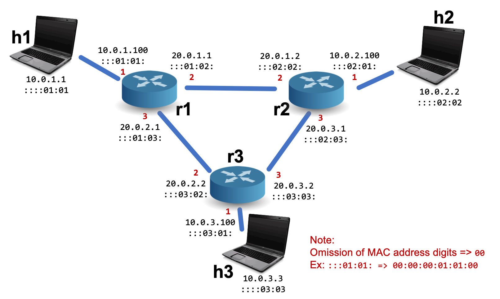

# Project 2: Implementing a Simple Router

This project is to be done individually.  Please refer to Canvas for the deadline.

## Introduction

In the last project, you implemented a Layer-2 learning Ethernet switch.
As we move up the networking stack, it is time to learn about the operation of a router, operating primarily at Layer-3 (L3).
The purpose of a router is to connect two or more L2 networks to form an *internetwork* or Internet.
Note that this is true even when two routers are directly connected to one another---the link between them will use Ethernet or a similar L2 protocol.
That link forms an L2 network, albeit one with only two members.
A router will, for every packet it routes, encapsulate it in an L2 frame, transmit it as physical signals, and it will be decapsulated at the other side.

By far the most common Layer-3 communications protocol is the Internet Protocol (IP).
Within IP, the most common variant is IPv4, although IPv6 is steadily gaining traction.
At this layer, messages are called *packets* and you can find their format here:

[RFC791: IPv4 Packet Structure](https://tools.ietf.org/html/rfc791#page-11)

There are several differences between Layer-2 and Layer-3, but a primary one is that we no longer have 'flat' addresses.
Instead, addresses are designed to give some indication as to where in the network the destination resides, and routers need cooperate to be able to efficiently route packets to those destinations rather than just forward them.
In the next project (project 3), we will look at some of the algorithms that are involved in creating efficient routes, but for now, let's assume that the router is pre-programmed with routes like in HW0 so that we can focus on the actual packet processing.


How does IPv4 interact with the L2 protocols we've learned about so far?  As mentioned in lecture, layering means that hosts and network devices often have a stack of protocols, e.g., Ethernet + IPv4, where packets are successively encapsulated by lower layers before being sent out.
That means that L3 devices (like hosts and routers) will have *both* an IP address and an Ethernet address.
Translating between the two is a protocol called the Address Resolution Protocol (ARP).
ARP is used to translate IP addresses into Ethernet MAC addresses, and ARP packets are formatted as follows:

[RFC 826: ARP](https://tools.ietf.org/html/rfc826)

[Wikipedia Summary](https://en.wikipedia.org/wiki/Address_Resolution_Protocol#Packet_structure)

A great walkthrough of the ARP translation process is given in:

[RFC 1180: A TCP/IP Tutorial](https://tools.ietf.org/html/rfc1180#section-4)


## Part A: Cloning the Framework

You can clone and build the framework exactly as you did in HW1.
We will continue to use Mininet and P4 to implement the router functionality;
however, the topology we will use in this homework is slightly different than before:



Here we have a Layer-3 network instead of a Layer-2 network.
One of the biggest differences is that, while host ports have always had unique IP/MAC addresses, router ports now have them as well!
The IPs of the host-facing ports on the routers are `10.0.1.100`, `10.0.2.100`, and `10.0.3.100`.
The MAC addresses of those ports are `00:00:00:01:01:00`, `00:00:00:02:01:00`, `00:00:00:03:01:00`, respectively.
Router-to-router ports also have IPs and MACs, as shown on the diagram.
Just as before, physical port numbers are labeled in red.

Take a look at the skeleton code in data_plane.p4 and control_plane.py.
data_plane.p4 includes complete parsing code.
The parser first extracts the Ethernet header, then it either extracts an IPv4 header or an ARP header, depending on the contents of the `etherType` field.
This is demultiplexing in action!
data_plane.p4 also includes L2 functionality and a valid ingress "apply" block that calls tables in the expected order.
We've marked the code with TODOs in every section of code that differs from the reference implementation---you shouldn't need to modify any other blocks.


## Part B: Completing the router implementation

Your goal at the end of this project is to be able to `ping` any host from any other host:

```console
# e.g., from h1:
ping 10.0.2.2 # h2
# Output:
PING 10.0.2.2 (10.0.2.2) 56(84) bytes of data.
64 bytes from 10.0.2.2: icmp_seq=1 ttl=64 time=0.261 ms
64 bytes from 10.0.2.2: icmp_seq=2 ttl=64 time=0.264 ms
64 bytes from 10.0.2.2: icmp_seq=3 ttl=64 time=0.243 ms
```

This ping is different than the utilities you have used in previous projects as it operates on top of L3 instead of L2.
As such, the host, h1, does some extra steps:

  1. It first tries to find the Ethernet address of the next hop on the route to `10.0.2.2` (`10.0.1.100`).  It does this by querying its ARP table, which you can view using the command `arp -n`.
  2. If the mapping does not exist, it sends out an ARP request.
  3. After it receives the ARP response (or if the mapping already existed), the h1 will send the L3 ping packet out with an Ethernet header destined to `00:00:00:01:01:00` and an IP header destined to `10.0.2.2`.
  4. Each router along the path will do a similar lookup -- they'll find the IP of the next hop on the route to the destination IP, find the MAC of the next hop on the path to the next IP, and then send the message out on the correct port.
  5. When the receiver, h2, gets the message, it will send an L3 ping response that may trigger the same ARP and routing process of steps 1-4 in order to get back to h1.


### Expected Behavior

To get the ping to work, you'll need to complete the implementation of both ARP responses and routing.
More specifically, your router should be able to do the following:

  1. Parse from the raw packet the correct Ethernet, ARP, and IPv4 headers.
    The only remaining parts of this are to complete the format specification for `header ipv4_t` and `header arp_t` using the RFCs.
  2. For L2 frames that the router should look into, set `metadata.forMe = 1` and pass it to higher-level functionality.
    Otherwise, set `metadata.forMe = 0` and drop the message.
    We have implemented the data plane portion of this logic.
    You will need to fill in the correct table entries using the control plane python program.
    Please refer back to the slides on MAC addressing to see how you should fill in this table.
  3. If the message is an ARP request, modify the packet into an ARP response and direct it out of the port it came in.
  See the provided resources for exactly how to do this.
  4. If the message is instead an IPv4 packet, look up the next Layer-3 hop using a longest-prefix match.
  Note that P4 includes LPM functionality natively.
  All you need to do is replace the keyword `exact` in a match specification with `lpm`, and slightly change the way we build table entries.
  See `control_plane.py` for an example usage.
  5. After the next hop in the Layer-3 network has been identified, find its Layer-2 address using a purely static ARP table, and forward with the correct Ethernet source/destination and to the correct physical port.
  "purely static" in this context means that you have manually added the ARP table entries and that the router never issues ARP requests of its own.
  Note that, in a real network, routers often do issue ARP requests, just like hosts.


**Tip #1**: As before, you might find it helpful to sketch out the intended functionality (with switch-case statements) before you dive into the P4 code.

**Tip #2**: You can check the ARP table of the hosts using the command `arp -n`.
A hardware address of "unknown" means that the ARP request has been issued, but no response was received.

**Tip #3**: Don't try to implement everything at once.
Break the functionality down into steps and use the logs to verify that each is implemented correctly before moving on.
For instance, if you were to comment out the unimplemented tables and issue a ping from h1, you should be able to observe the `tiHandleEthernet` miss in `logs/r1.log`.
You should be able to implement Step 2 just using these logs.
Similarly, you should be able to implement ARP responses (Step 3) and verify using `arp -n` before ever touching Steps 4 or 5.


## Submission and Grading

Submit your `data_plane.p4` and `control_plane.py` to Canvas.  Make sure to **Indicate your name and PennKey in a comment at the top of both files.**

As always, start early and feel free to ask questions on Piazza and in office hours.


